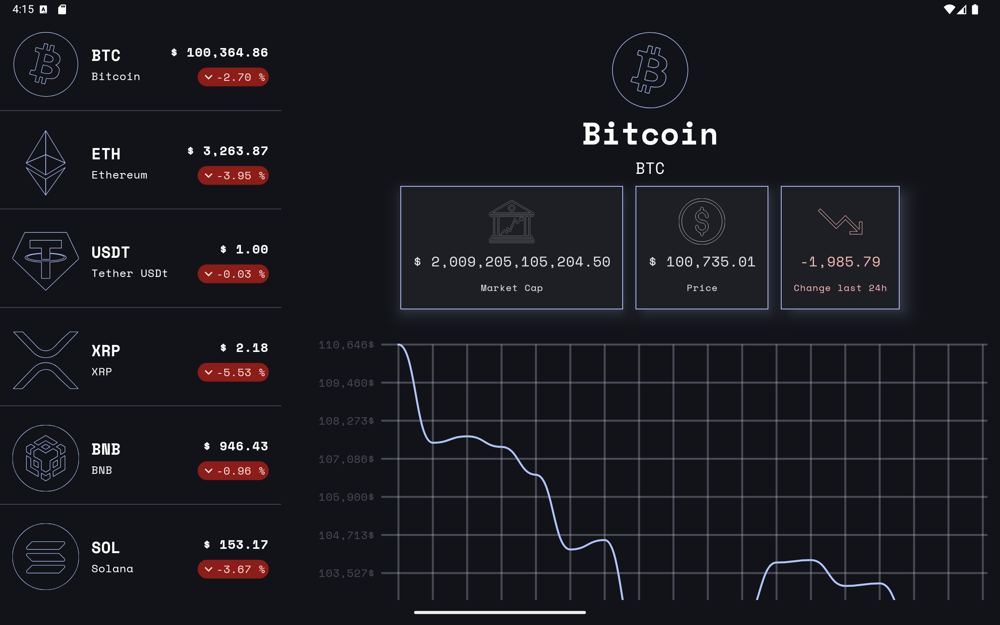
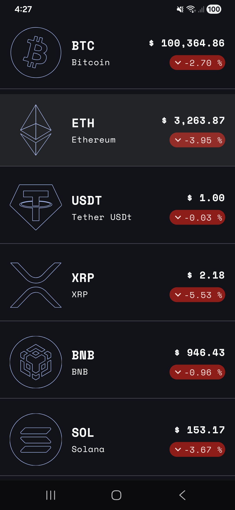
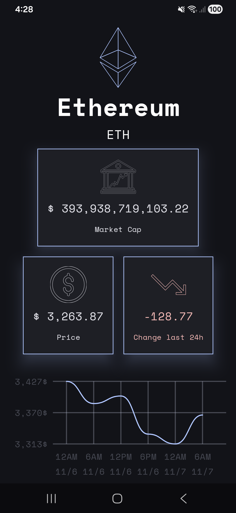

<h1>🪙 CryptoTracker — Modern Android Architecture App</h1>

  A <strong>clean-architecture Android app</strong> built to explore and display cryptocurrency data —
  including live coin lists, detailed stats, and <strong>custom Canvas chart</strong> visualizations —
  following modern Android best practices.

  
  
  
  

<h2>📸 Screenshots</h2>

  
  
  
  

<!-- Features -->
<h2>🚀 Features</h2>

<h3>🧩 Clean Architecture with MVI pattern</h3>

Organized codebase with separation of concerns — easy to test, maintain, and scale.

<h3>💉 Koin Dependency Injection</h3>

Lightweight DI for managing app dependencies with minimal boilerplate.

<h3>🌐 Ktor Client for REST API calls</h3>

Efficient, coroutine-friendly HTTP client to fetch crypto data.

<h3>🎨 Canvas Chart Drawing</h3>

Custom charting using the <code>Canvas</code> API (no third-party chart libs).

<h3>🧭 Adapter Navigation</h3>

Smooth navigation with clear UI state handling.

<h3>📱 Responsive UI</h3>

Layouts adapt beautifully to different screen sizes and orientations.

<h3>🔐 Secure API Key Handling</h3>

Environment-safe API key management following best practices.

<h3>🌓 Dynamic Theming (Light &amp; Dark Mode)</h3>

Automatic support for system-wide themes, delivering a consistent and visually adaptive experience.

<h2>🧠 What I Learned</h2>

Built alongside the
  <a href="https://pl-coding.com/best-practice-guide/" target="_blank" rel="noopener noreferrer">
    Modern Android Architecture course
  </a>.

<ul>
  <li>Designing <strong>modular, scalable</strong> clean architecture.</li>
  <li>Integrating <strong>Koin</strong> for dependency injection.</li>
  <li>Performing network calls with <strong>Ktor</strong> and robust response handling.</li>
  <li>Implementing <strong>MVI</strong> for predictable, testable state management.</li>
  <li>Drawing <strong>dynamic charts</strong> using Canvas + Compose.</li>
  <li>Building a <strong>responsive UI</strong> for phones and tablets.</li>
  <li>Applying <strong>secure packaging &amp; key management</strong> for production apps.</li>
</ul>

<!-- Tech stack -->
<h2>🏗️ Tech Stack</h2>
<table>
  <tr><td><strong>Language</strong></td><td>Kotlin</td></tr>
  <tr><td><strong>Architecture</strong></td><td>Clean Architecture (MVI)</td></tr>
  <tr><td><strong>DI</strong></td><td>Koin</td></tr>
  <tr><td><strong>Networking</strong></td><td>Ktor</td></tr>
  <tr><td><strong>UI</strong></td><td>Jetpack Compose, Canvas</td></tr>
  <tr><td><strong>Navigation</strong></td><td>Adapter Navigation / Jetpack Navigation</td></tr>
  <tr><td><strong>Async</strong></td><td>Kotlin Coroutines, Flow</td></tr>
  <tr><td><strong>Design</strong></td><td>Material 3, Light/Dark themes</td></tr>
  <tr><td><strong>Build</strong></td><td>Gradle (KTS)</td></tr>
</table>

<h2>⚙️ Setup &amp; Run</h2>
<ol>
  <li>Clone the repo:
    <pre><code>git clone https://github.com/abdur-android-dev/CryptoTracker-Android-Jetpack-Compose.git</code></pre>
  </li>
  <li>Open in <strong>Android Studio</strong>.</li>
  <li>Add your API key to a secure place (create new file. <code>key.properties</code>):
    <pre><code># key.properties
API_KEY="your_api_key_here"</code></pre>
    <em>Read it at build/runtime via BuildConfig or Gradle encrypted vars (do not commit keys).</em>
  </li>
  <li>Run the app 🚀</li>
</ol>

<!-- Acknowledgements -->
<h2>🙌 Acknowledgements</h2>
<ul>
  <li>
    <a href="https://pl-coding.com/best-practice-guide/" target="_blank" rel="noopener noreferrer">
      PL-Coding — Master Modern Android Architecture
    </a>
  </li>
  <li>
    <a href="https://pro.coincap.io/api-docs" target="_blank" rel="noopener noreferrer">
      Coincap API
    </a>
  </li>
</ul>

<!-- License -->
<h2>🧾 License</h2>

Released under the <strong>MIT License</strong>. You are free to use, modify, and distribute this project with attribution.

<!-- Contact -->
<h2>📬 Connect</h2>

  <a href="https://www.linkedin.com/in/abdurrehman-android-dev/">LinkedIn</a> ·
  <a href="mailto:abdurrehmankhan75@gmail.com">Email</a>

